# LAB9_ARSW 🚀 
**_Integrantes:_**

* _Angie Daniela Ruiz Alfonso_
* _Juan Sebastian Díaz Salamanca_

### Escuela Colombiana de Ingeniería
### Arquitecturas de Software - ARSW

## Escalamiento en Azure con Maquinas Virtuales, Sacale Sets y Service Plans

### Dependencias
* Cree una cuenta gratuita dentro de Azure. Para hacerlo puede guiarse de esta [documentación](https://azure.microsoft.com/en-us/free/search/?&ef_id=Cj0KCQiA2ITuBRDkARIsAMK9Q7MuvuTqIfK15LWfaM7bLL_QsBbC5XhJJezUbcfx-qAnfPjH568chTMaAkAsEALw_wcB:G:s&OCID=AID2000068_SEM_alOkB9ZE&MarinID=alOkB9ZE_368060503322_%2Bazure_b_c__79187603991_kwd-23159435208&lnkd=Google_Azure_Brand&dclid=CjgKEAiA2ITuBRDchty8lqPlzS4SJAC3x4k1mAxU7XNhWdOSESfffUnMNjLWcAIuikQnj3C4U8xRG_D_BwE). Al hacerlo usted contará con $200 USD para gastar durante 1 mes.

### Parte 0 - Entendiendo el escenario de calidad

Adjunto a este laboratorio usted podrá encontrar una aplicación totalmente desarrollada que tiene como objetivo calcular el enésimo valor de la secuencia de Fibonnaci.

**Escalabilidad**
Cuando un conjunto de usuarios consulta un enésimo número (superior a 1000000) de la secuencia de Fibonacci de forma concurrente y el sistema se encuentra bajo condiciones normales de operación, todas las peticiones deben ser respondidas y el consumo de CPU del sistema no puede superar el 70%.

### Escalabilidad Serverless (Functions)

1. Cree una Function App tal cual como se muestra en las  imagenes.

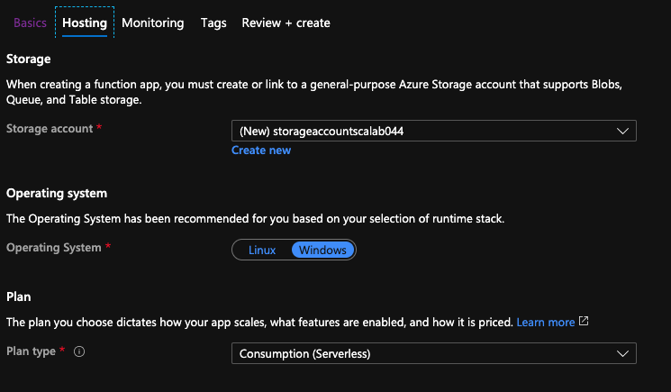

2. Instale la extensión de **Azure Functions** para Visual Studio Code.

3. Despliegue la Function de Fibonacci a Azure usando Visual Studio Code. La primera vez que lo haga se le va a pedir autenticarse, siga las instrucciones.

4. Dirijase al portal de Azure y pruebe la function.

5. Modifique la coleción de POSTMAN con NEWMAN de tal forma que pueda enviar 10 peticiones concurrentes. Verifique los resultados y presente un informe.

6. Cree una nueva Function que resuleva el problema de Fibonacci pero esta vez utilice un enfoque recursivo con memoization. Pruebe la función varias veces, después no haga nada por al menos 5 minutos. Pruebe la función de nuevo con los valores anteriores. ¿Cuál es el comportamiento?.

### Informe

_Se modificó la colección de POSTMAN con NEWMAN, luego para verificar que funcionara correctamente abrimos una consola para probar, como vimos que se ejecutaba correctamente, procedimos a abrir varias consolas para la simulación del uso de la función por medio de 4 clientes conectados, logrando ver que todas las peticiones se aceptaron de manera éxitosa, que se obtuvo un tiempo de respuesta de 523 ms y un espacio de trabajo de meoria de 263.45 mb (este teniendo en cuenta que enviamos muchas peticiones antes de las 4 para pruebas). Concluyendo así que a pesar de que la implementación es ineficiente, al usar la infraestructura serverless se logra responder a todas las peticiones que hace el cliente de manera rápida pero existe un consumo alto de recursos de cpu._

_Evidencias:_

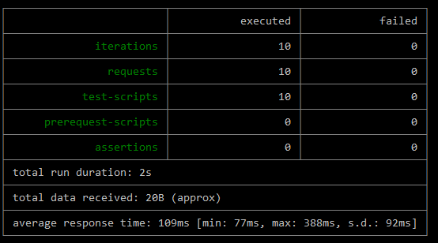

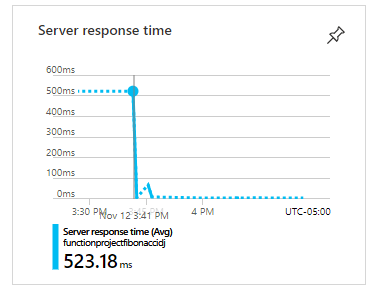

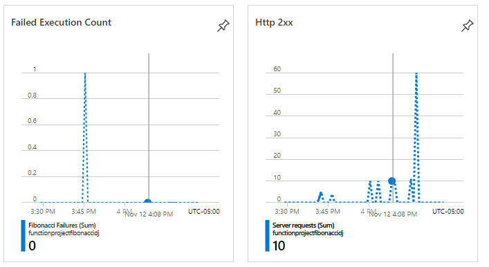

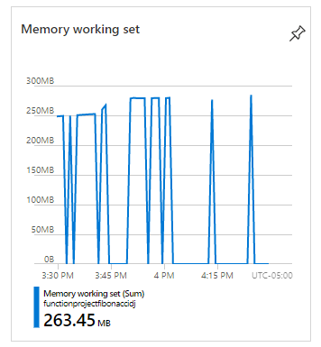

_Usando memoization, provando varias veces:_

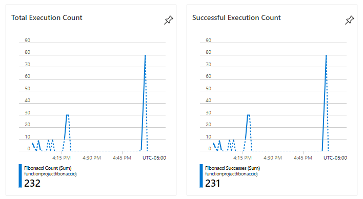

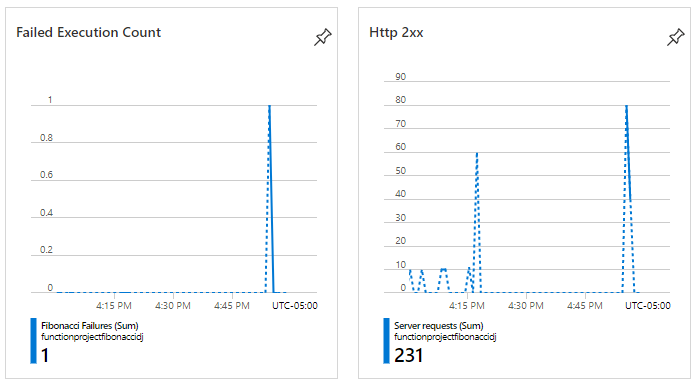

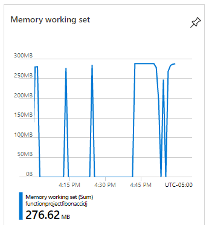

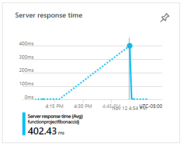

_Esperando 5 minutos sin hacer nada y volviendo a probar:_

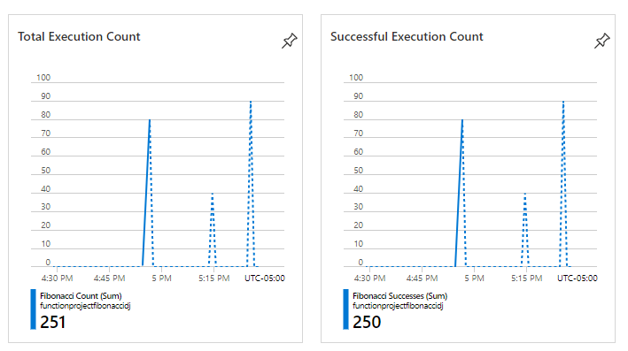

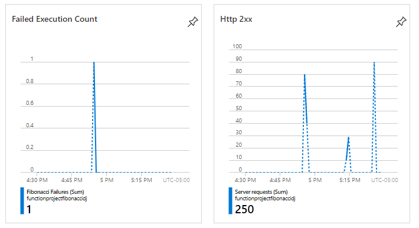

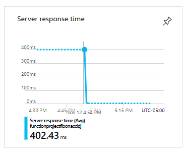

_Luego de implementar la función recursivamente usando memoización para guardar las resultados y no tener que realizar cálculos repetidos, llegamos a la conclusión de que el comportamiento de los tiempos de respuesta son mucho más bajos comparados con la anterior implemtanción en la cual no se usaba esta técnica de optimización, se debe tener en cuenta que al principio son más altos debido a que no hay respuestas guardadas en la memoria, pero va mejorando a medida que transcurre el tiempo cuando se realizan más peticiones y la memoria empieza a aumentar, logrando así un tiempo de respuesta casi inmediato._

_Pero después de esperar 5 minutos sin hacer nada el tiempo de respuesta a las peticiones se incrementó nuevamente, esto debido a que transcurridos 5 minutos de inactividad de la función los datos almacenados en memoria se limpian automáticamente, haciendo que sea necesario volver a hacer calculos que ya se tenian previamente, esto no sería así si tuviesemos un plan diferente al que seleccionamos, el cual fue consumption plan y sería aún más eficiente._

**Preguntas**

* ¿Qué es un Azure Function?

  _Es un **servicio serverless** el cual nos permite ejecutar fácilmente pequeños fragmentos de código o funciones en la nube (el cual se basa en pagar solo por los recursos consumidos), dejando de lado las preocupaciones externas al desarrollo de la funcionalidad que requerimos en sí. Estos servicios se pueden implementar en lenguajes como **JavaScript, C#, Python, PHP**, entre otros, al igual que en opciones de scripting como **Bash, Batch y PowerShell**; también permite codificar tanto en el portal de Azure como en nuestra aplicación, para después integrarla configurando la integración continua que nos oferce Azure. Este servicio se factura según el número total de ejecuciones solicitadas cada mes para todas las funciones, donde las ejecuciones se cuentan cada vez que se ejecuta una función en respuesta a un evento, desencadenado por un enlace y el primer millón de ejecuciones es gratis cada mes._

* ¿Qué es serverless?

  _**Serverless** (Sin servidor) es un tipo de arquitectura en el que como su nombre lo indica no se utilizan servidores, ya sean físicos o en la nube, sino que se asigna la responsabilidad de ejecutar un fragmento de código a un proovedor de la nube y este se encarga de realizar una asignación dinámica de recursos, logrando así escalar automáticamente si crece la demanda y liberar cuando baja esta. Se cobra por la cantidad de recursos utilizados para ejecutar el código, código que generalmente se ejecuta dentro de contenedores stateless que pueden ser activados por una variedad de eventos como **solicitudes http, eventos de bases de datos, servicios de cola, cargas de archivos, eventos programados**, entre otros._
  
  
  _El código que se envía a la nube para ejecución suele tener la forma de una función, por ende severless en ocasiones se refiere a **“Functions as a Service" (FaaS)** y estas son ofrecidas por los proovedores de nube, donde las principales funciones son: AWS: **AWS Lambda**, Microsoft Azure: **Azure Functions** y Google Cloud: **Cloud Functions**._

* ¿Qué es el runtime y que implica seleccionarlo al momento de crear el Function App?

  _El **runtime** (Tiempo de ejecución) es el intervalo de tiempo en el cual un programa de computadora se ejecuta y Azure se basa este. Nosotros utilizamos **Consumption plan** y la versión de **runtime** 12, lo cual nos implica que el tiempo de timeout será de 5 minutos y además nuestra memoria se limpiará en este intervalo de tiempo._
  

* ¿Por qué es necesario crear un Storage Account de la mano de un Function App?

  _**Azure Functions** es basado en **Azure Storage** para las operaciones de almacenamiento y de administración como lo son: el Manejo de triggers y los logs. Entonces **Azure Storage** account nos proporciona un espacio de nombres únicos para el almacenamiento._

* ¿Cuáles son los tipos de planes para un Function App?, ¿En qué se diferencias?, mencione ventajas y desventajas de cada uno de ellos.

  _**Consumption plan** nos ofrece escalabilidad dinámica y facturación solo cuando la aplicación es ejecutada, teniendo un timeout de 5 minutos y una memoria máxima de 1.5 GB por instancia (máximo 200 instancias) y un almacenamiento de 1 GB._
  
  _**Premium** nos ofrece escalabilidad dinámica, facturación por el número en segundos de Core y la memoria usada en las distintas instancias, puede tener timeouts ilimitados, memoria por instancia (máximo 100 instancias) de 3.5 GB y un almacenamiento de hasta 250 GB._
  
  _**Dedicated** El cliente puede implementar manualmente la escalabilidad, puede tener timeouts ilimitados, memoría por instancia de 1.7 GB y una capacidad de almacenamiento hasta de 1000 GB y el numero de instancias es máximo 20. En este plan se paga lo mismo que por otros recursos de App Service, como las aplicaciones web.._

* ¿Por qué la memoization falla o no funciona de forma correcta?

  _Nosotros usamos el **consumption plan** que nos ofrece 1.5 GB por instancia, donde vemos que este tamaño se nos puede quedar corto a la hora de hacer peticiones con valores muy grandes, ya que no los calculará debido a que el stack de memoria se llenará al no tener la estrucutura suficiente para almacenar los datos necesarios, por ende el servidor no podrá soportarlo y nos lamnzará una excepción._

* ¿Cómo funciona el sistema de facturación de las Function App?

  _**Azure Functions** hace la facturación según el consumo de los recursos y las ejecuciones por segundo, donde los precios del plan de consumo incluyen 1 millones de solicitudes y 400.000 GB-segundos de consumo de recursos gratuitos por mes. **Functions** hace la facturación según el consumo de recursos medido en GB-s, donde el consumo de recursos se calcula multiplicando el tamaño medio de memoria en GB por el tiempo en milisegundos que dura la ejecución de la función. Y la memoria que una función utiliza se mide redondeando a los 128 MB más cercanos hasta un tamaño de memoria máximo de 1.536 MB, y el tiempo de ejecución se redondea a los 1 ms más cercanos y para la ejecución de una única función, el tiempo de ejecución mínimo es de 100 ms y la memoria mínima es de 128 MB, respectivamente._

